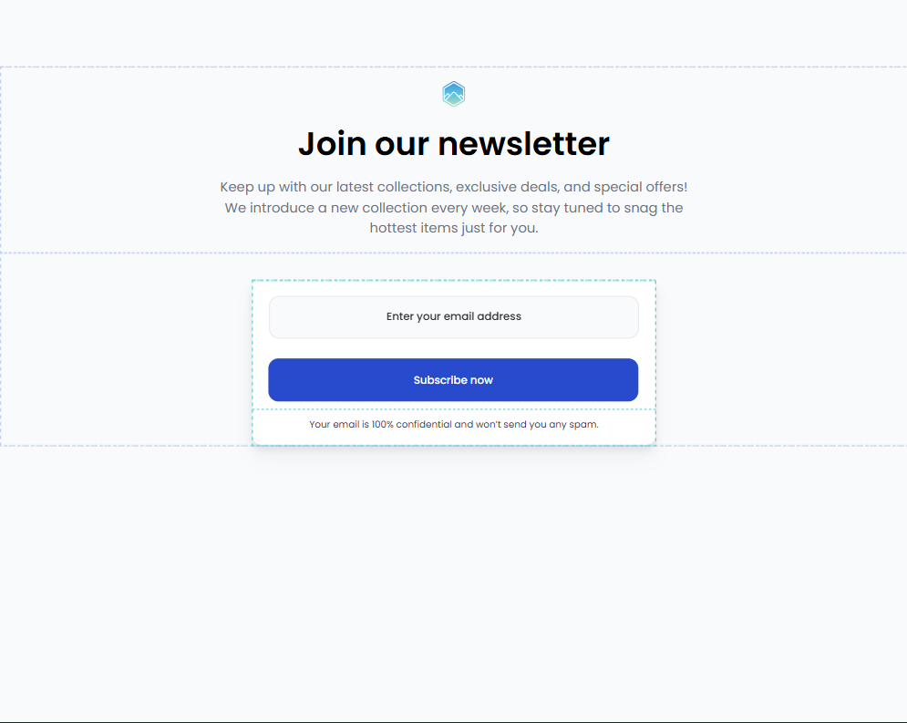
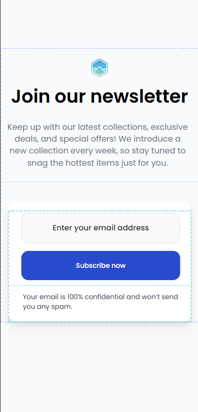

<!-- Please update value in the {}  -->

<h1 align="center">Join Our Newsletter | devChallenges</h1>

A simple page that display the structure of the newsletter blog with HTML and CSS.

Solution for a challenge <a href="https://devchallenges.io/challenge/join-our-newsletter" target="_blank">Join Our Newsletter</a> from <a href="http://devchallenges.io" target="_blank">devChallenges.io</a>.

  <h3>
    <a href="https://devcristo-06.github.io/join-newsletter/">
      Demo
    </a>
     | 
    <a href="https://devchallenges.io/learn/2-responsive-web/css-essential-cheat-sheet">
      Solution
    </a>
     | 
    <a href="https://devchallenges.io/challenge/join-our-newsletter">
      Challenge
    </a>
  </h3>

<!-- TABLE OF CONTENTS -->

## Table of Contents

- [Overview](#overview)
  - [What I learned](#what-i-learned)
  - [Useful resources](#useful-resources)
- [Built with](#built-with)
- [Features](#features)
- [Contact](#contact)
- [Acknowledgements](#acknowledgements)

<!-- OVERVIEW -->

## Overview

<!--
Introduce your projects by taking a screenshot or a gif. Try to tell visitors a story about your project by answering:

- What have you learned/improved?
- Your wisdom? :)
-->

### What I learned

I learned to know flexbox better and use CSS properties better.
Instead, in the HTML structure, it always remains semantic and clean.

Here too, I enjoyed using media queries because you learn to manage the spaces of any device.

The only useful source that I used often, is the "CSS Cheat Sheet" of devchallenges.io because it provides a series of useful instructions to make the styles you have applied readable.

<!-- Use this section to recap over some of your major learnings while working through this project. Writing these out and providing code samples of areas you want to highlight is a great way to reinforce your own knowledge. -->

### Useful resources

- [Essential CSS Cheat Sheet](https://devchallenges.io/learn/2-responsive-web/css-essential-cheat-sheet#9.-Media-Queries) - From the official site that I completed the project, I reviewed the media queries of how they were composed and useful lines to avoid using excessive margins and padding
<!--
- [Example resource 1](https://www.example.com) - This helped me for XYZ reason. I really liked this pattern and will use it going forward.
- [Example resource 2](https://www.example.com) - This is an amazing article which helped me finally understand XYZ. I'd recommend it to anyone still learning this concept.
  -->

### Built with

<!-- This section should list any major frameworks that you built your project using. Here are a few examples.-->

- Semantic HTML5 markup
- CSS custom properties
- Flexbox
- CSS Grid

## Features

<!-- List the features of your application or follow the template. Don't share the figma file here :) -->

This application/site was created as a submission to a [DevChallenges](https://devchallenges.io/challenges-dashboard) challenge.

## Author

- Cristofaro Cecoro
- GitHub [@devCristo-06](https://github.com/devCristo-06)
